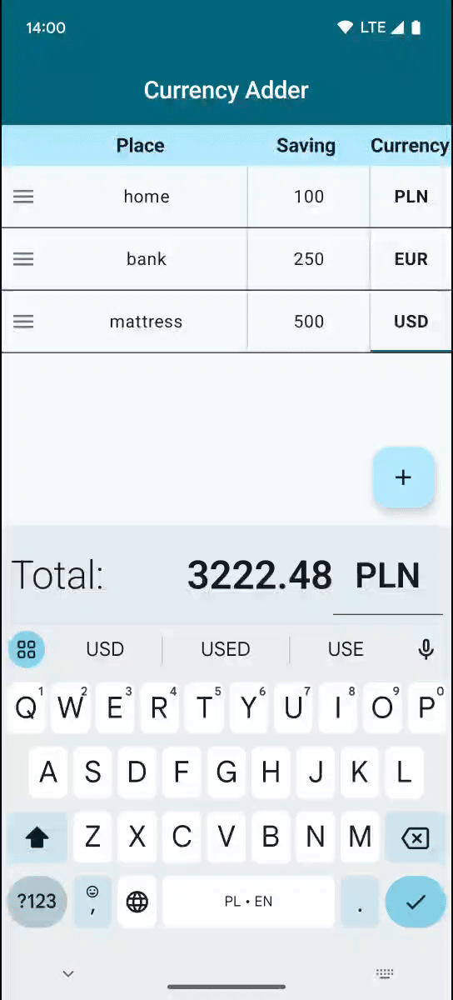
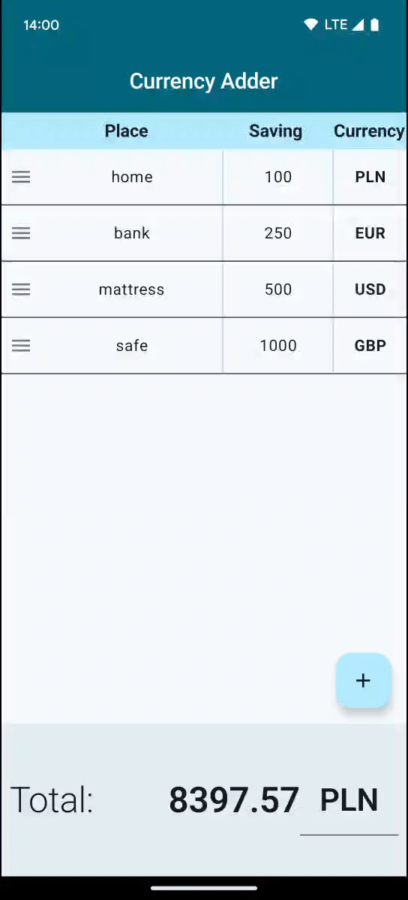

# **Currency adder (sumator walutowy)**

Android project, generated using [Android Starter](https://github.com/krzdabrowski/android-starter-2022).

  
  

### **Features**
* manage your savings in multiple currencies
* see your total savings in any of the supported currency
* authenticate only via biometrics - your savings are safe from third party access
* by third party I mean everything - no analytics, tracking etc

If you don't believe my words, then just take a look at the codebase :sweat_smile: it is open-source after all.

Exchange rates are taken from [National Polish Bank's API](http://api.nbp.pl/).

### **Libraries/concepts used**

* Gradle modularised project by features
* The Clean Architecture with MVI pattern in presentation layer
* Jetpack Compose with Material3 design - for UI layer
* Kotlin Coroutines & Kotlin Flow - for concurrency & reactive approach
* Kotlin Serialization converter - for JSON parsing
* Retrofit - for networking
* Hilt - for Dependency Injection pattern implementation
* Room - for local database
* Version Catalog - for dependency management
* Baseline and Startup Profiles - for performance improvements during app launch
* Timber - for logging
* JUnit5, Turbine and MockK - for unit tests
* Jetpack Compose test dependencies and Hilt - for UI tests
* KtLint and Detekt - for code linting
